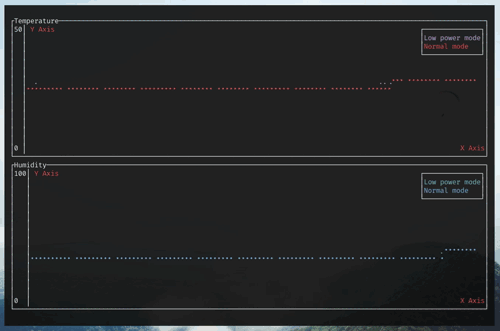

# Rust SHTCx Driver

[![Build status][workflow-badge]][workflow]
[![Test coverage][codecov-badge]][codecov]
[![Crates.io Version][crates-io-badge]][crates-io]
[![Crates.io Downloads][crates-io-download-badge]][crates-io-download]

This is a platform agnostic Rust driver for the Sensirion SHTCx temperature /
humidity sensor series, based on the
[`embedded-hal`](https://github.com/rust-embedded/embedded-hal) traits.

Tested with the following sensors:

- [SHTC3](https://www.sensirion.com/shtc3/)

Support for the SHTC1 will be added later on. Support for SHTWx should be
doable as well, since the protocol seems to be very similar.

This driver currently uses only blocking calls. Non-blocking measurements may
be added in the future. Clock stretching is not implemented and probably won't
be.

Docs: https://docs.rs/shtcx

## The Device

The Sensirion SHTCx series offers low-power high-precision digital temperature
and humidity sensors that communicate over the I²C bus. 

## Status

- [x] Measure temperature and humidity
- [x] Get device identifier
- [ ] Sleep / Wakeup commands
- [ ] Soft reset and general call reset
- [x] Support for low power mode
- [x] CRC checks
- [ ] Docs

## Examples

There are two examples in the `examples` directory: The `linux` example queries
the sensor a few times using `linux-embedded-hal`, while the `monitor` example
implements a terminal based real-time graphical temperature/humidity monitoring
tool.

## License

Licensed under either of

 * Apache License, Version 2.0 ([LICENSE-APACHE](LICENSE-APACHE) or
   http://www.apache.org/licenses/LICENSE-2.0)
 * MIT license ([LICENSE-MIT](LICENSE-MIT) or
   http://opensource.org/licenses/MIT) at your option.

### Contributing

Unless you explicitly state otherwise, any contribution intentionally submitted
for inclusion in the work by you, as defined in the Apache-2.0 license, shall
be dual licensed as above, without any additional terms or conditions.

<!-- Badges -->
[workflow]: https://github.com/dbrgn/shtcx-rs/actions?query=workflow%3ACI
[workflow-badge]: https://img.shields.io/github/workflow/status/dbrgn/shtcx-rs/CI/master
[codecov]: https://codecov.io/gh/dbrgn/shtcx-rs
[codecov-badge]: https://codecov.io/gh/dbrgn/shtcx-rs/branch/master/graph/badge.svg
[crates-io]: https://crates.io/crates/shtcx
[crates-io-badge]: https://img.shields.io/crates/v/shtcx.svg?maxAge=3600
[crates-io-download]: https://crates.io/crates/shtcx
[crates-io-download-badge]: https://img.shields.io/crates/d/shtcx.svg?maxAge=3600
